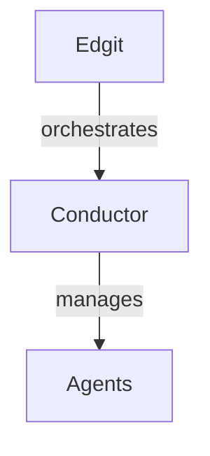

# Documentation Update Standards

## Overview

This document defines the standards for maintaining and updating documentation across all Ensemble products. All documentation lives in the `ensemble-edge/docs` repository and follows a consistent structure for seamless navigation and maintenance.

## Repository Structure
````
ensemble-edge/docs/
├── README.md                  # Documentation hub overview
├── getting-started/           # Quick start guides for all products
│   ├── index.md              # Overview and product selection
│   ├── edgit.md              # Edgit quick start
│   ├── conductor.md          # Conductor quick start
│   └── ensemble.md           # Ensemble platform quick start
├── edgit/                     # Edgit product documentation
│   ├── README.md             # Edgit overview
│   ├── installation.md       # Setup and installation
│   ├── configuration.md      # Configuration options
│   ├── api-reference/        # API documentation
│   ├── guides/               # How-to guides
│   ├── examples/             # Code examples
│   └── troubleshooting.md    # Common issues and solutions
├── conductor/                 # Conductor orchestration platform
│   ├── README.md             # Conductor overview
│   ├── architecture.md       # System architecture
│   ├── agents/               # Agent documentation
│   ├── workflows/            # Workflow patterns
│   ├── api-reference/        # API documentation
│   └── deployment.md         # Deployment guides
├── shared/                    # Shared components and utilities
│   ├── authentication.md     # Common auth patterns
│   ├── error-handling.md     # Standard error codes
│   ├── data-models.md        # Shared data structures
│   └── best-practices.md     # Cross-product best practices
├── api/                       # Unified API documentation
│   ├── rest/                 # REST API specs
│   ├── graphql/              # GraphQL schemas
│   └── webhooks/             # Webhook documentation
└── archive/                   # Deprecated documentation
````

## Documentation Standards

### 1. File Naming Convention
````
- Use lowercase with hyphens: `api-reference.md`, not `APIReference.md`
- Be descriptive: `error-handling.md`, not `errors.md`
- Use index.md for category landing pages
- Version-specific docs: `migration-v2-to-v3.md`
````

### 2. Document Structure Template

Every documentation file must follow this structure:
````markdown
# [Feature/Component Name]

> **Product**: [Edgit | Conductor | Ensemble]  
> **Version**: v[X.Y.Z]  
> **Last Updated**: YYYY-MM-DD

## Overview
[Brief description of what this document covers]

## Prerequisites
- Required knowledge
- Required tools/access
- Related documentation links

## [Main Content Sections]

## Examples
[Practical, runnable examples]

## API Reference (if applicable)
[Link to detailed API docs]

## Common Issues
[Known issues and solutions]

## Related Documentation
- [Related Topic 1](link)
- [Related Topic 2](link)

## Changelog
- YYYY-MM-DD: [Description of change]
````

### 3. Code Examples Standards
````typescript
// ✅ ALWAYS: Complete, runnable examples with context
import { Conductor } from '@ensemble/conductor';

/**
 * Example: Setting up a basic Conductor workflow
 * This example demonstrates error handling and retry logic
 */
async function setupWorkflow() {
  const conductor = new Conductor({
    apiKey: process.env.CONDUCTOR_API_KEY,
    environment: 'production',
  });

  const workflow = conductor.createWorkflow({
    name: 'data-processing',
    retryPolicy: {
      maxAttempts: 3,
      backoffMultiplier: 2,
    },
  });

  // ... complete example
}

// ❌ NEVER: Incomplete snippets without context
conductor.run() // What is conductor? How was it initialized?
````

### 4. Cross-References

When referencing other products or shared components:
````markdown
## Integration with Conductor

Edgit seamlessly integrates with [Conductor](/conductor/README.md) for orchestration.

### Authentication
Uses shared authentication model. See [Authentication Guide](/shared/authentication.md).

### Data Models
Implements standard Ensemble data models. See [Data Models Reference](/shared/data-models.md).
````

### 5. Version Documentation
````markdown
## Version Compatibility

| Edgit Version | Conductor Version | Ensemble Platform |
|---------------|-------------------|-------------------|
| 2.x           | 3.x               | 1.5+              |
| 1.x           | 2.x               | 1.0+              |

For migration guides, see [Migration Documentation](/edgit/migrations/).
````

## Update Process

### 1. Documentation Update Workflow
````bash
# 1. Clone the docs repository
git clone git@github.com:ensemble-edge/docs.git
cd docs

# 2. Create feature branch
git checkout -b docs/[product]-[feature]
# Examples: docs/edgit-api-update, docs/conductor-agents

# 3. Make changes following standards

# 4. Run documentation validation
npm run validate-docs

# 5. Preview changes locally
npm run preview

# 6. Commit with conventional commits
git commit -m "docs(edgit): add error handling guide"
git commit -m "docs(conductor): update agent configuration"

# 7. Push and create PR
git push origin docs/[product]-[feature]
````

### 2. Automated Sync from Product Repos

Each product repository should have a `docs/` folder that syncs to the main documentation:
````yaml
# .github/workflows/sync-docs.yml in product repos
name: Sync Documentation
on:
  push:
    paths:
      - 'docs/**'
    branches:
      - main

jobs:
  sync:
    runs-on: ubuntu-latest
    steps:
      - uses: actions/checkout@v3
      
      - name: Sync to ensemble-edge/docs
        run: |
          # Copy product-specific docs to main repo
          cp -r docs/* ../ensemble-edge/docs/${{ env.PRODUCT_NAME }}/
          
      - name: Create PR
        uses: peter-evans/create-pull-request@v5
        with:
          title: "docs(${{ env.PRODUCT_NAME }}): sync from product repo"
          branch: auto-sync/${{ env.PRODUCT_NAME }}
````

### 3. Documentation Review Checklist

Before merging documentation updates:

- [ ] **Accuracy**: Technical details are correct
- [ ] **Completeness**: All necessary information included
- [ ] **Examples**: Working code examples provided
- [ ] **Cross-references**: Links to related docs work
- [ ] **Consistency**: Follows documentation standards
- [ ] **Clarity**: Clear for target audience
- [ ] **Versioning**: Version compatibility noted
- [ ] **Navigation**: Fits logical information architecture

## Writing Guidelines

### Tone and Voice

- **Professional but approachable**: Write as a knowledgeable colleague
- **Action-oriented**: Use imperative mood for instructions
- **Concise**: Get to the point quickly
- **Inclusive**: Avoid jargon without explanation

### Examples
````markdown
✅ GOOD: "Configure the API endpoint by setting the `ENSEMBLE_API_URL` environment variable."
❌ BAD: "You might want to think about possibly configuring the endpoint."

✅ GOOD: "This error occurs when the rate limit is exceeded. Wait 60 seconds before retrying."
❌ BAD: "Sometimes things don't work because of reasons related to doing things too much."
````

### Technical Writing Principles

1. **Start with why**: Explain the purpose before the how
2. **Show, don't just tell**: Include examples
3. **Progressive disclosure**: Basic info first, advanced later
4. **Scannable content**: Use headers, lists, and emphasis
5. **Searchable**: Use keywords naturally

## Product-Specific Sections

### Edgit Documentation

Focus areas:
- Component registry management
- Git integration workflows
- CLI command reference
- Configuration schemas
- Migration guides

### Conductor Documentation

Focus areas:
- Agent architecture
- Workflow orchestration
- Event-driven patterns
- Performance tuning
- Deployment strategies

### Future Products

When adding new products:

1. Create new top-level directory
2. Follow same structure as existing products
3. Update main README.md with product entry
4. Add to getting-started index
5. Update navigation configuration
6. Set up automated sync workflow

## Maintenance Schedule

- **Weekly**: Review and merge documentation PRs
- **Monthly**: Audit for broken links and outdated content
- **Quarterly**: Major documentation reorganization if needed
- **Per Release**: Update version-specific documentation

## Documentation Tools

### Required Tools
````bash
# Install documentation tools
npm install -g @ensemble/doc-tools

# Validate documentation structure
doc-tools validate

# Check for broken links
doc-tools check-links

# Generate API documentation from code
doc-tools generate-api

# Preview documentation site
doc-tools preview
````

### Markdown Extensions

We support these markdown extensions:

- **Mermaid diagrams**: For architecture diagrams
- **Code tabs**: For multiple language examples
- **Admonitions**: For notes, warnings, tips
- **Include files**: For shared content chunks
````markdown
:::note
This is an informational note.
:::

:::warning
This is a warning message.
:::

:::tip
This is a helpful tip.
:::

````

## Quality Standards

### Documentation is Code

- Documentation goes through same review process as code
- Documentation bugs are real bugs
- Documentation debt is technical debt
- Documentation tests prevent regression

### Metrics

Track these metrics monthly:

- Documentation coverage (% of features documented)
- Time to first successful API call (from docs)
- Documentation-related support tickets
- Documentation contribution rate

## Getting Help

- **Slack**: #ensemble-docs channel
- **GitHub Issues**: Label with `documentation`
- **Office Hours**: Weekly documentation review sessions
- **Templates**: Available in `/templates` directory

---

**Remember**: Great documentation is as important as great code. It's the interface between your brilliant engineering and the developers who will build on it.